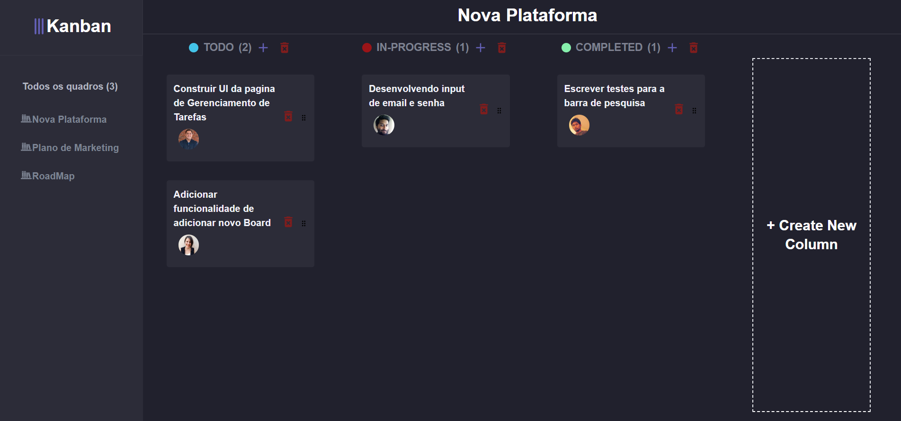

# Kanban-App

  <a href="#-tecnologias">Tecnologias</a>&nbsp;&nbsp;&nbsp;|&nbsp;&nbsp;&nbsp;
  <a href="#memo-licença">Licença</a>

  

 

  

## 🚀 Tecnologias

Esse projeto foi desenvolvido com as seguintes tecnologias:

- TypeScript
- React.js
- Next.js
- HTML e CSS

## :memo: Licença

Esse projeto está sob a licença MIT.

---

# Instalação
## Clone este repositório em sua máquina local:
~~~javascript
git clone https://github.com/eldinho2/Kanban-App.git
~~~
## Acesse o diretório do projeto:
~~~javascript
cd Travel-App
~~~
## Instale as dependências do projeto:
~~~javascript
npm install
~~~
## Inicie o aplicativo em modo de desenvolvimento:
~~~javascript
npm run dev
~~~
#### O aplicativo será aberto em http://localhost:3000 no seu navegador padrão.
